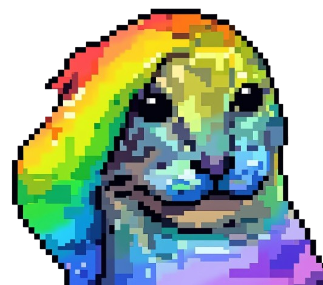
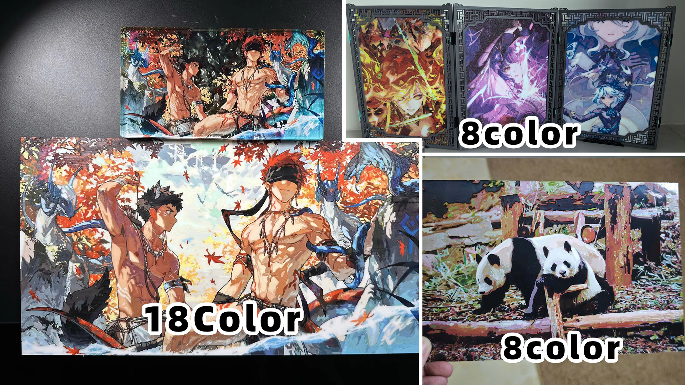
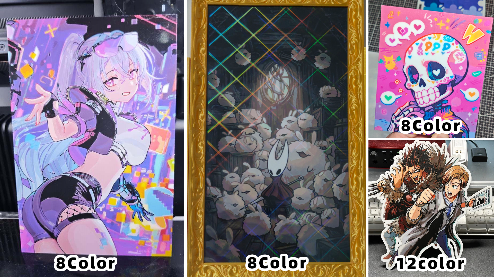
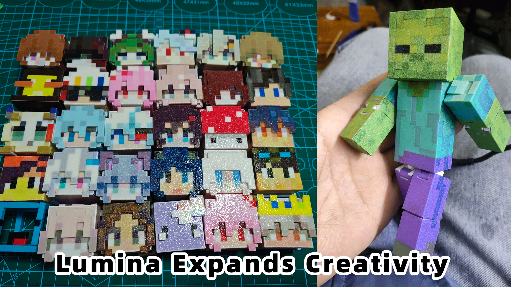
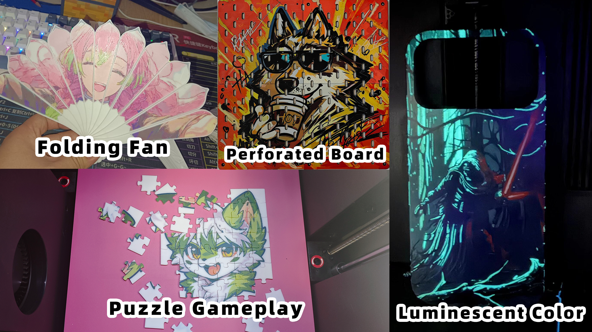
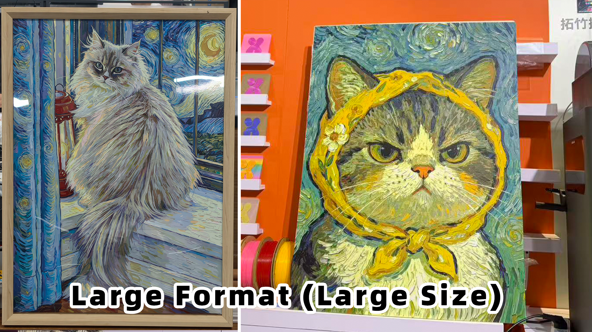
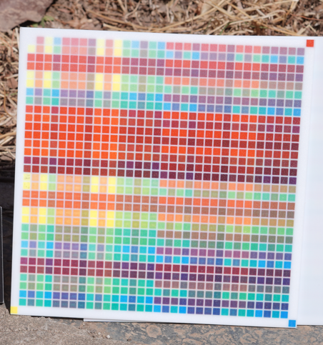
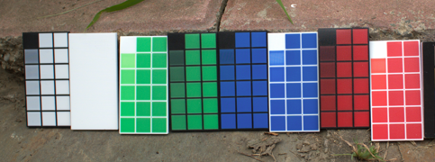

  

<h1 align="center">Lumina Studio</h1>

  基于实物拍摄校准的 FDM 彩色图片生成器

  把动画图、表情包和真实照片转换为可切片的多材料模型。

  <a href="README.md">English</a>
  ·
  <a href="https://github.com/lumina-layer-studio/Lumina-Layers/releases">下载 1.x</a>
  ·
  <a href="https://wiki.luminastudio.com.cn/">项目 Wiki</a>
  ·
  <a href="https://www.bilibili.com/video/BV1dhcqzSEaq">校准视频</a>

  
  &nbsp;&nbsp;
  

  

  
  
  
  
  
  

  
  
  
  

> [!NOTE]
> 这里是 Lumina Studio 1.x 的公开仓库。Lumina Studio 2.0 仍在私有仓库内测，当前计划于 2026 年 10 月开源。下方作品同时包含 1.x 和 2.0 的实际打印结果，具体能力以对应版本说明为准。

## Lumina 能做什么

Lumina 会把图片转换成由多层、多种耗材组成的模型，再通过固定层高下的颜色叠加获得最终画面。1.x 主要覆盖 2、4、6、8 色工作流；2.0 内测版正在尝试自定义颜色数量、层数和层高。

颜色数量和模型结构不只影响画面，也能带来更多玩法。平面画、立式摆件、像素角色、折扇、拼图、洞洞板、夜光手机壳和大尺寸拼接作品，都可以从同一套思路延伸出来。

## 用户实际打印效果

  

从 8 色到 18 色的画面表现。标签沿用用户作品中的颜色标注。

  

立式摆件、装裱作品和不同颜色数量的实际效果。

  

Lumina 不只用于平面画面，也可以继续发展成立体和可活动结构。

  

折扇、洞洞板、拼图玩法和夜光颜色。

  

大尺寸作品可以分块制作，再进行拼接或装裱。

这些照片均为真实打印作品，不是软件预览截图。用户照片经许可展示，画面中原始作品的版权仍归各自创作者所有。

## 现在使用 Lumina Studio 1.x

公开版本地址：[lumina-layer-studio/Lumina-Layers](https://github.com/lumina-layer-studio/Lumina-Layers)

- 稳定安装包：[GitHub Releases](https://github.com/lumina-layer-studio/Lumina-Layers/releases)
- 最新自动构建：[GitHub Actions](https://github.com/lumina-layer-studio/Lumina-Layers/actions)
- 1.x 完整教程：[项目 Wiki](https://wiki.luminastudio.com.cn/zh/docs/legacy/lumina-studio-1x-guide)
- 切片设置教程：[多品牌切片设置](https://wiki.luminastudio.com.cn/zh/docs/tutorials/slicer-guide)

### 最短使用流程

1. 导入图片。
2. 选择或导入与耗材匹配的预设。
3. 生成并打开 3MF。
4. 在切片软件中确认耗材顺序，然后打印。

## 为什么需要校准

耗材标签上的颜色并不等于实际打印出来的颜色。光线穿过多层材料后，会受到叠放顺序、层高、打印参数、耗材批次和拍摄环境影响。Lumina 先记录真实打印结果，再用这些结果为图片寻找合适的分层组合。

### 1.x：固定色卡和实物取色

  

1.x 使用固定色卡进行穷举或简化穷举，再通过拍照取色生成预设。它的优点是所见即所得；缺点是更换打印机、耗材组合或关键参数后，通常需要重新校准。

观看视频：[Lumina Studio 1.x 校准流程](https://www.bilibili.com/video/BV1dhcqzSEaq)

### 2.0 内测：梯度色卡

  

2.0 内测版引入梯度色卡，用一套校准结果配合计算模拟得到混色效果。它更方便混用不同材料，也减少重复校准；但拍摄误差和优化过程仍可能带来偏色，需要通过真实打印继续验证。

查看作品集：[Lumina Studio 2.0 内测用户作品](https://www.bilibili.com/opus/1211359624212512770)

> 2.0 尚未在此仓库公开。这里展示的是内测方向和实物结果，不代表 1.x 已经包含相同功能。

## 文档、社区与支持

更多技术文档、教程和更新记录请前往[项目 Wiki](https://wiki.luminastudio.com.cn/)；问题讨论可以加入 QQ 群 `371270714` 或 [Discord](https://discord.gg/57whRe3C8G)。

Lumina Studio 是非营利性开源社区项目。赞助用于开发、测试、打包、文档和社区维护。公开的 1.x 代码使用 [GNU GPL v3.0](LICENSE)。

## 贡献者

  

感谢所有提交代码、测试结果、预设、翻译和文档的贡献者。

